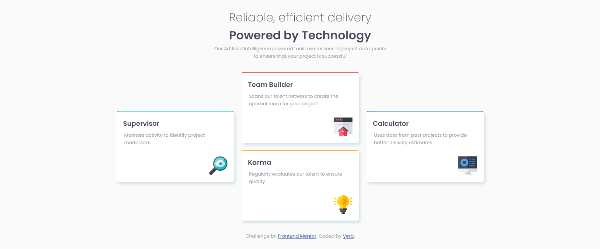

# Frontend Mentor - Four card feature section solution

This is a solution to the [Four card feature section challenge on Frontend Mentor](https://www.frontendmentor.io/challenges/four-card-feature-section-weK1eFYK). Frontend Mentor challenges help you improve your coding skills by building realistic projects.

## Overview

### The challenge

- Four Card Future Section

### Screenshot

### Links

- Solution URL: [https://www.frontendmentor.io/solutions/four-card-future-section-with-css-grid-and-flexbox-xggI45tnTK]
- Live Site URL: [https://verakissyou17.github.io/Four-Card-Future-Section/)]

## My process

### Built with

- Semantic HTML5 markup
- CSS custom properties
- Flexbox
- CSS Grid

## Author

- Website - [https://github.com/verakissyou17]
- Frontend Mentor - [https://www.frontendmentor.io/profile/verakissyou17]
